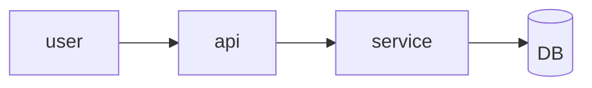

# Design: <name>

## 1. Context
Summary of the PRD requirements this design satisfies (link FR/NFR ids).

## 2. Proposed solution
High-level description, then a diagram (Mermaid is fine).

## 3. Components and responsibilities
| Component | Responsibility | New / changed |
|---|---|---|

## 4. Interfaces
APIs, events, schemas, CLI contracts. Include request/response examples and error cases.

## 5. Data
Models, migrations, retention, ownership.

## 6. Alternatives considered
| Option | Pros | Cons | Why not |
|---|---|---|---|
Record the chosen option as an ADR (`chatur adr new "<decision>"`).

## 7. Cross-cutting concerns
- **Security & privacy:** see `docs/security/threat-model*.md`.
- **Performance & scale:**
- **Observability:** logs, metrics, traces, alerts.
- **Failure modes & rollback:**

## 8. Testing strategy
Unit, integration, e2e; what each layer covers (feeds the test plan).

## 9. Rollout plan
Feature flags, migration order, backward compatibility.

## 10. Open questions
