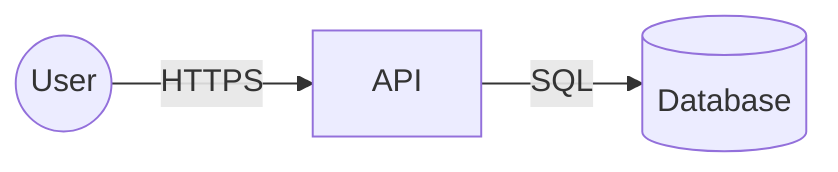

# Threat model: <system/feature>

## 1. Scope and assets
What is in scope; the assets worth protecting (data, credentials, availability, money, reputation).

## 2. Data-flow diagram and trust boundaries

Mark every place data crosses a trust boundary.

## 3. Threats (STRIDE)
| ID | Component / flow | STRIDE | Threat | Likelihood | Impact | Mitigation | Status |
|---|---|---|---|---|---|---|---|
| T-1 | | Spoofing | | L/M/H | L/M/H | | Open / Mitigated / Accepted |

STRIDE = Spoofing, Tampering, Repudiation, Information disclosure, Denial of service, Elevation of privilege.

## 4. Security requirements
Concrete controls that must exist before release (authn/z, input validation, secrets handling,
encryption, logging, rate limits, dependency policy).

## 5. Accepted risks
Each accepted risk needs an owner and an ADR.

## 6. Verification
How each mitigation will be tested (feeds the test plan and security review).
